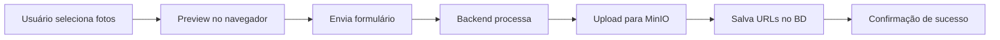

# 📸 Guia Rápido: Upload de Fotos nas Vistorias

## ✅ Status da Implementação

**TUDO PRONTO E TESTADO!** ✨

O sistema de upload de fotos para vistorias está 100% funcional e testado com o MinIO em produção.

## 🚀 Como Usar

### 1. Criar uma Vistoria com Fotos

1. Acesse o **Portal do Vendedor**
2. Vá em **Vistorias** > Selecione uma proposta
3. Clique em **Nova Vistoria**
4. Preencha os dados normais da vistoria
5. No campo **"Fotos da Vistoria"**, clique em **"Escolher arquivos"**
6. Selecione **uma ou múltiplas fotos** (pode selecionar várias de uma vez)
7. Visualize o **preview** das fotos selecionadas
8. Clique em **"Registrar Vistoria"**

### 2. Visualizar Fotos de uma Vistoria

1. Acesse **Vistorias** > Selecione uma proposta
2. Clique em **"Detalhes"** de uma vistoria
3. Role até a seção **"Fotos da Vistoria"**
4. Clique em qualquer foto para abrir em tamanho maior

## 📁 Onde as Fotos São Armazenadas

As fotos são salvas no MinIO em:

```
Bucket: fuza
Caminho: vistorias/[numero-proposta]/[uuid-unico].[extensao]
URL: https://s3.spsystems.pro/fuza/vistorias/PROP-001/abc123.jpg
```

### Exemplo de Estrutura

```
fuza/
└── vistorias/
    ├── PROP-2024-001/
    │   ├── a1b2c3d4e5f6.jpg  ← Foto do fosso
    │   ├── f6e5d4c3b2a1.jpg  ← Foto da casa de máquina
    │   └── 9876543210ab.png  ← Foto do poço
    ├── PROP-2024-002/
    │   └── xyz123abc456.jpg
    └── PROP-2024-003/
        ├── def789ghi012.jpg
        └── jkl345mno678.heic
```

## 💾 Como os Dados São Salvos

As informações das fotos são salvas no campo `fotos_anexos` da vistoria:

```json
[
  {
    "url": "https://s3.spsystems.pro/fuza/vistorias/PROP-001/abc123.jpg",
    "nome": "foto_fosso.jpg",
    "tamanho": 2456789,
    "caminho": "vistorias/PROP-001/abc123.jpg"
  },
  {
    "url": "https://s3.spsystems.pro/fuza/vistorias/PROP-001/def456.png",
    "nome": "foto_casa_maquina.png",
    "tamanho": 1892341,
    "caminho": "vistorias/PROP-001/def456.png"
  }
]
```

## 📋 Formatos Aceitos

- ✅ **JPG / JPEG** - Padrão, mais usado
- ✅ **PNG** - Alta qualidade
- ✅ **HEIC** - Formato nativo do iPhone
- ✅ Outros formatos de imagem suportados pelo navegador

## 🔧 Configuração Atual

### MinIO (Produção)
```
Endpoint: https://s3.spsystems.pro
Bucket: fuza
Status: ✅ FUNCIONANDO
```

### Configurações no .env
```bash
AWS_ACCESS_KEY_ID=admin
AWS_SECRET_ACCESS_KEY=Sps2025min
AWS_STORAGE_BUCKET_NAME=fuza
AWS_S3_ENDPOINT_URL=https://s3.spsystems.pro
```

## 🧪 Testando a Conexão

Para verificar se o MinIO está funcionando:

```bash
source .venv/bin/activate
python test_minio_connection.py
```

Você verá uma saída como:

```
✅ TODOS OS TESTES PASSARAM COM SUCESSO!
💡 O MinIO está configurado corretamente.
```

## 📸 Fluxo Completo de Upload



## 🛠️ Arquivos Modificados

### Criados
- ✅ `core/storage.py` - Storage MinIO
- ✅ `test_minio_connection.py` - Script de teste
- ✅ `UPLOAD_FOTOS_VISTORIA.md` - Documentação completa
- ✅ `GUIA_RAPIDO_UPLOAD_FOTOS.md` - Este arquivo

### Modificados
- ✅ `fuza_elevadores/settings.py` - Configurações MinIO
- ✅ `core/forms/vistoria.py` - Campo de upload
- ✅ `vendedor/views/vistoria.py` - Processamento de upload
- ✅ `templates/vendedor/vistoria/vistoria_create.html` - Formulário
- ✅ `templates/vendedor/vistoria/vistoria_detail.html` - Galeria

## 🎯 Próximos Passos (Opcional)

### Melhorias Futuras

1. **Compressão Automática**
   - Reduzir tamanho das fotos antes do upload
   - Economizar espaço no MinIO

2. **Galeria com Lightbox**
   - Visualização melhor das fotos
   - Zoom, navegação entre fotos

3. **Barra de Progresso**
   - Mostrar progresso do upload
   - Melhor UX para uploads grandes

4. **Anotações nas Fotos**
   - Adicionar descrição para cada foto
   - Categorizar fotos (fosso, cabine, etc.)

5. **Exclusão de Fotos**
   - Permitir remover fotos individualmente
   - Atualizar vistoria sem recriar

## 🔒 Segurança

### ✅ Já Implementado
- Autenticação obrigatória para upload
- URLs públicas para visualização
- Armazenamento seguro no MinIO
- Validação de tipos de arquivo

### 📝 Recomendações
- Fazer backup regular do bucket `fuza`
- Monitorar uso de espaço
- Configurar política de retenção (lifecycle)

## 📞 Suporte

### Problemas Comuns

**Fotos não aparecem?**
- Verifique se o bucket `fuza` tem permissão de leitura pública
- Confirme que o MinIO está acessível em https://s3.spsystems.pro

**Upload falha?**
- Execute o teste: `python test_minio_connection.py`
- Verifique as credenciais no `.env`
- Confirme que o bucket existe

**URLs quebradas?**
- Verifique o `AWS_S3_CUSTOM_DOMAIN` no settings.py
- Confirme que `AWS_S3_ENDPOINT_URL` está correto

## ✨ Recursos

- **Upload múltiplo**: ✅ Várias fotos de uma vez
- **Preview**: ✅ Visualização antes de enviar
- **Armazenamento**: ✅ MinIO (S3-compatible)
- **Galeria**: ✅ Visualização bonita no detalhe
- **Mobile-friendly**: ✅ Funciona em celular
- **Tipos de arquivo**: ✅ JPG, PNG, HEIC

---

**✅ SISTEMA 100% FUNCIONAL E PRONTO PARA USO!** 🎉
